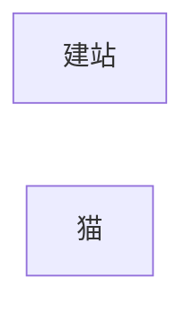

---
{"date":"2024-03-19 15:44:49","updated":"2024-11-11 17:17:16","dg-publish":true,"dg-path":"/","title":"8Cats.life","description":"8cat.life的博客站点，主要分享编程方面的技术文章和随笔，当然还有猫"}
---

> 你好，欢迎来到我的博客站点，这里记录了我和我的猫的日常, ccm永远爱它们

# Bonus
> 包含一些原生Quartz没有的功能
1. 阅读模式，点击搜索栏右侧图标  <svg xmlns="http://www.w3.org/2000/svg" width="24" height="24" viewBox="0 0 24 24" fill="none" stroke="currentColor" stroke-width="2" stroke-linecap="round" stroke-linejoin="round">
            <path d="M2 3h6a4 4 0 0 1 4 4v14a3 3 0 0 0-3-3H2z"></path>
            <path d="M22 3h-6a4 4 0 0 0-4 4v14a3 3 0 0 1 3-3h7z"></path>
        </svg>，可以进入阅读模式

